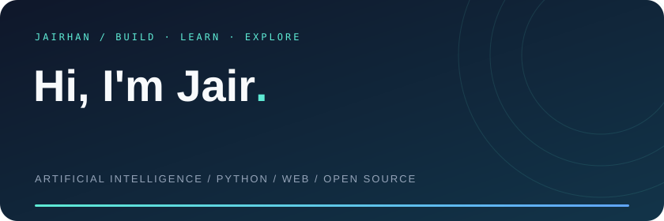

学习人工智能，用代码解决日常问题。

AI · Python · Web Development · Developer Tools

## 关于我

- 🧠 正在学习 **人工智能**，探索模型与实际应用的结合。
- 🛠️ 喜欢编写 **Python 工具、自动化脚本和 Web 应用**。
- 🌱 在开源项目和日常实践中持续学习，把想法变成能用的小工具。
- 📫 邮箱：[hanjair9@gmail.com](mailto:hanjair9@gmail.com)

## 技术与工具

## GitHub 数据

每天自动更新。活动统计采用 GitHub 最近一年贡献口径；语言占比按本人公开非 Fork 仓库的代码字节数计算，不代表熟练程度。

## Contribution Snake

<picture>
  <source media="(prefers-color-scheme: dark)" srcset="assets/snake-dark.svg" />
  <source media="(prefers-color-scheme: light)" srcset="assets/snake.svg" />
  
</picture>

## 项目一览

| 项目 | 简介 | Stars |
| :--- | :--- | :---: |
| [Fund](https://github.com/JairHan/Fund) | 基金净值实时估算工具，支持持仓穿透、实时行情和 Docker 部署。 |  |
| [chess-helper-app](https://github.com/JairHan/chess-helper-app) | 中国象棋辅助工具，支持 JJ象棋、天天象棋，提供走法推荐。 |  |
| [zsh-completions-translate-plugin](https://github.com/JairHan/zsh-completions-translate-plugin) | 为 Zsh 补全参数说明提供中文翻译、缓存与终端对齐显示。 |  |
| [deliCheck](https://github.com/JairHan/deliCheck) | 得力 e+ GPS 定位签到工具，支持配合青龙面板使用。 |  |
| [pvz_ios](https://github.com/JairHan/pvz_ios) | 植物大战僵尸杂交版的 iOS 移植项目。 |  |

指标由 Shields.io 自动获取并缓存更新：Public Repos 包含 Fork 仓库；Total Stars 为账号公开仓库获得的 Stars 总数，并非收藏数。

---

欢迎交流，也欢迎看看我的 [其他项目 →](https://github.com/JairHan?tab=repositories)

Icons by [Devicon](https://github.com/devicons/devicon) · Snake by [Platane/snk](https://github.com/Platane/snk)
